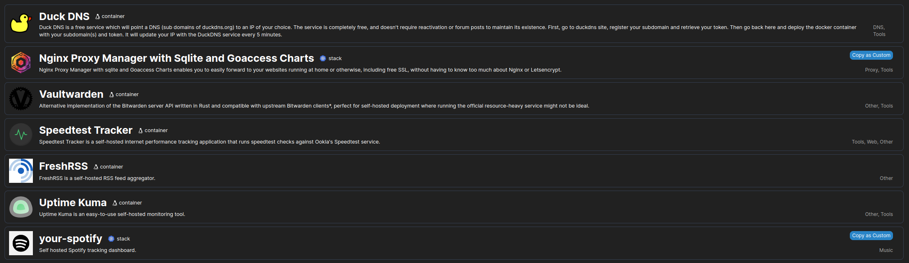

# Docker templates
Welcome to the Docker Templates repository. This template contains a curated list of containers designed to be easily installed with [Portainer](https://github.com/portainer/portainer), a powerful container management tool. This collection is continuously growing, with a primary focus on self-hosting.


### Container List

The image above show some of the available containers in this template.


### Usage
You just simply need to go to settings in Portainer and paste the following link into 'App Templates' -> URL
```
https://raw.githubusercontent.com/darchap/docker-templates/main/template/template.json
```

#### Additional Resources
If you need help installing Portainer on a Debian-based system, you may find the following repository helpful: https://github.com/darchap/dsfb